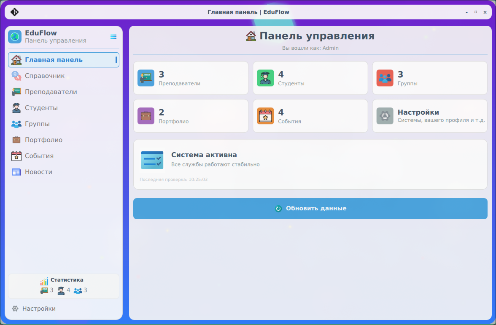
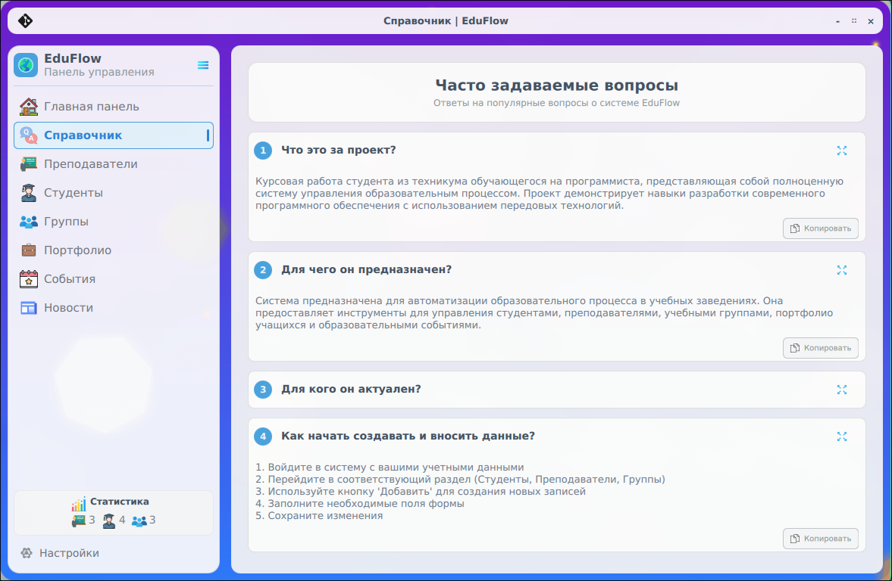
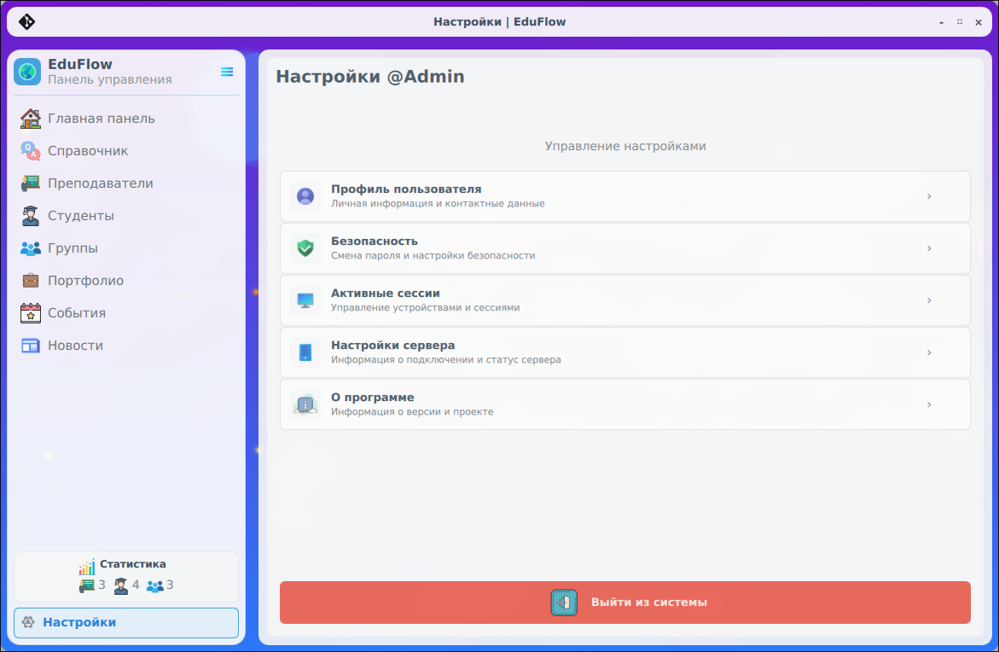
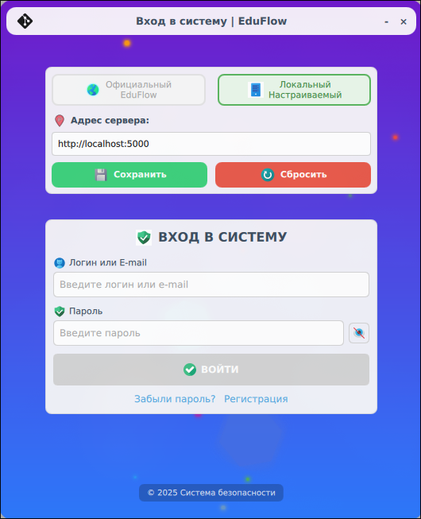

# Курсовая работа EduFlow, клиентское ПО

🍩 **EduFlow** — это клиентское программное обеспечение, предназначенное для обеспечения связи между пользователем и данными с серверной части.

🀄 Курсовая работа демонстрирующая работу с базой данных

### 🎁 Для чего нужен EduFlow?

* EduFlow создан для взаимодействия обычного пользователя в целях ваимодействия с базой данных и сохранения данных.

---

> [!IMPORTANT]
> 
> 📚 Проект используется как одной из важных частей курсового проекта "Студенты". Разработано студентом в направлении IT-сферы. Программа создана по структуре клиент-сервер с поддержкой работы API. Благодаря такой структуры легко размещать сервера и вести учёт данных с разных устройств, что позволяет легко масштабировать программу на учебные заведения.
> 
> Для работы потребуется серверная часть, так как это клиентская часть и не может полностью функционировать без размещения сервера.
>
> Настроить подключение к определенному серверу можно в окне авторизации, выбрав подключение к локальному серверу.

---

### 📋 Основные функции клиента:
🔗 Связь между клиентом и сервером:

- Отправка API запросов на сервер;
- Отображение данных и структурирование данных;
- Работа с учётной записью пользователя (управление сессией и персональной информацией);

### 🎓 Образовательный функционал:
- Управление пользователями (студенты, преподаватели);
- Организация курсов и учебных материалов;

### 🌟 Преимущества:
Централизованное управление данными
- Масштабируемость;
- Кроссплатформенная совместимость;
- Безопасность образовательной информации;

---

### 🍒 Инструменты разработки EduFlow
- Qt Creator
- C++17

### 🧱 Кроссплатформенность
В настоящее время поддержка есть на многие операционные системы (Windows, Linux, Android). Также преподалагается кроссплатформенность и для Apple операционных систем (IOs, MacOS).

---

### ⚡️ Демонстрационный пример работы клиентской части:

  
   
  <em>Рисунок 1.1 - Пример работы: главное меню</em>

  
   
  <em>Рисунок 1.2 - Пример работы: справочное меню</em>

  
   
  <em>Рисунок 1.3 - Пример работы: меню настроек</em>

  
   
  <em>Рисунок 1.4 - Пример работы: меню настроек</em>

---

### Помощь автору

⭐️ Если вам будет не сложно, проявите помощь начинающему программисту, поставьте звёздочку на репозиторий. Такая помощь будет очень ценна.

📡 Скомпилированную серверную программу вы можете проверить и установить: [Yandex Disk](https://disk.yandex.com/d/_lgpWOVGQEvFOA)

🛡 **Используется лицензия, ознакомьтесь с ней обязательном порядке!**